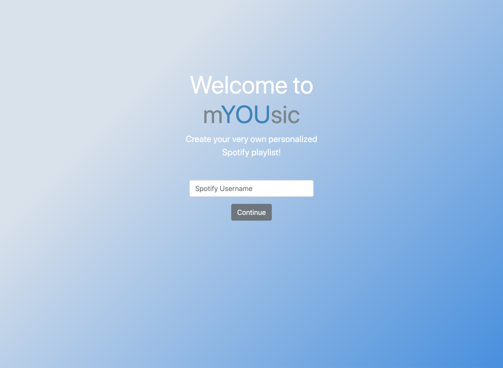
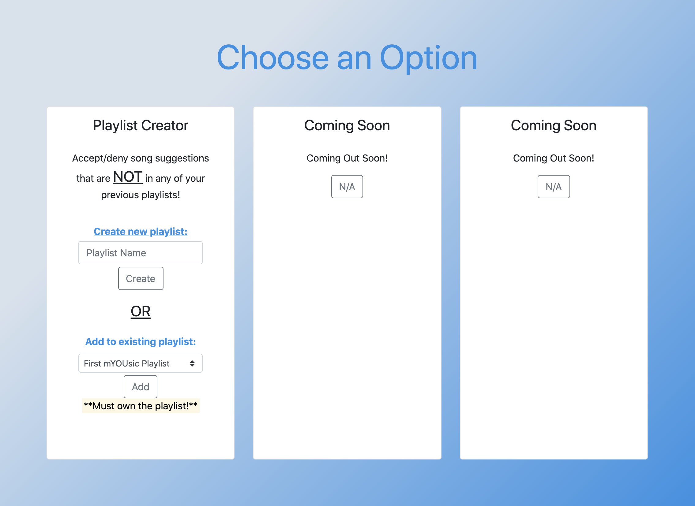
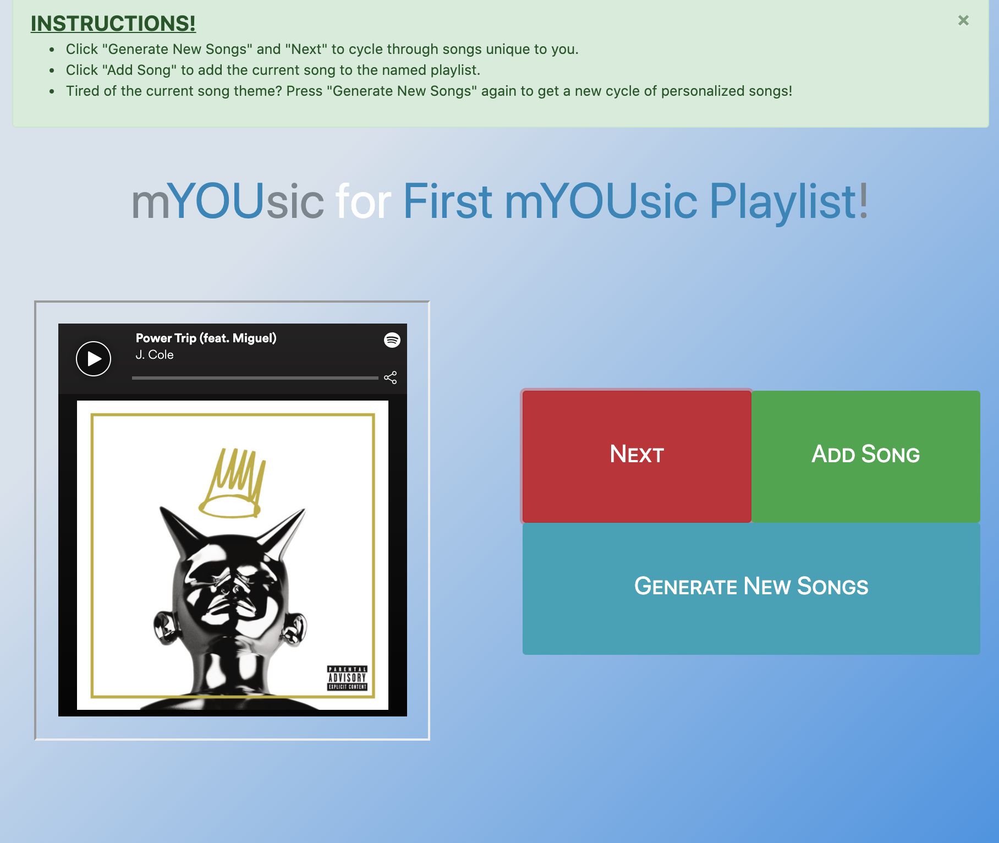

# mYOUsic

## Concept
mYOUsic is a Flask App that utlizes the Spotify Web API to help you create a personalized playlists consisting of songs that don't exist in any of your other playlists. Songs are suggested based off your most listened to artists and songs in the past 6 months. 

## Built With
- Flask web framework
- Spotify Web API

## Config Variables
I created a separate "secrets.py" file storing the below variables. You can also export the following as environment variables. 

Name          | Description                 | Value
------------- | --------------------------- | -----------------------------
API_BASE      | Spotify Web API Resource    | 'https://accounts.spotify.com' 
REDIRECT_URI  | Address of redirection after success/failure. Specified on Spotify Developer Dashbord| 'http://127.0.0.1:5000/authenticate' 
SECRET_KEY    | Flask cookie encryption key | Random sequence of characters
SCOPE         | Authorization levels of access for sharing personal account information   | 'playlist-read-private playlist-read-collaborative user-top-read playlist-modify-public playlist-modify-private'
CLI_ID     | Unique identifier of application    | On Spotify Dashboard
CLI_SECRET | Secure key passed in secure API calls      | On Spotify Dashboard   


## Usage
#### 1. Create Spotify Developers Account
Log into https://developer.spotify.com/dashboard/ and create a new app in order to obtain your unique client id and client secret. You must also specifiy your redirect URI. 
#### 2. Install dependencies
```bash
$ cd pathtoapp
$ pip install -r requirements.txt
```
#### 3. Config variables

Set the variables in the **Config Variables** section to a file called secrets.py or set as environment variables. 


#### 4. Run development server
```bash
$ python3 app.py
```

## Development Status
There are several things I want to add/improve on in the future.
- Handle errors better
- Add different modes other than a playlist creator (ex. game mode)
- Incorporate other APIs (Genius API?)
- Format pages better
- Deploy app

## Images





